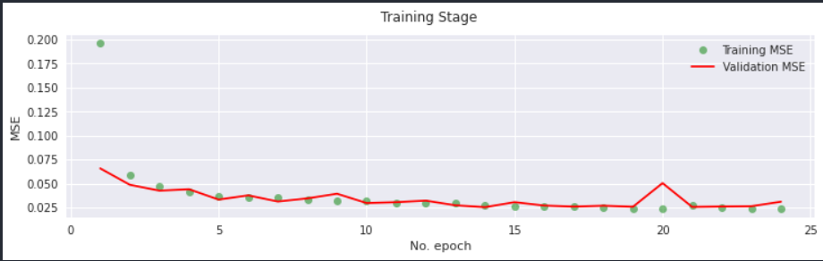
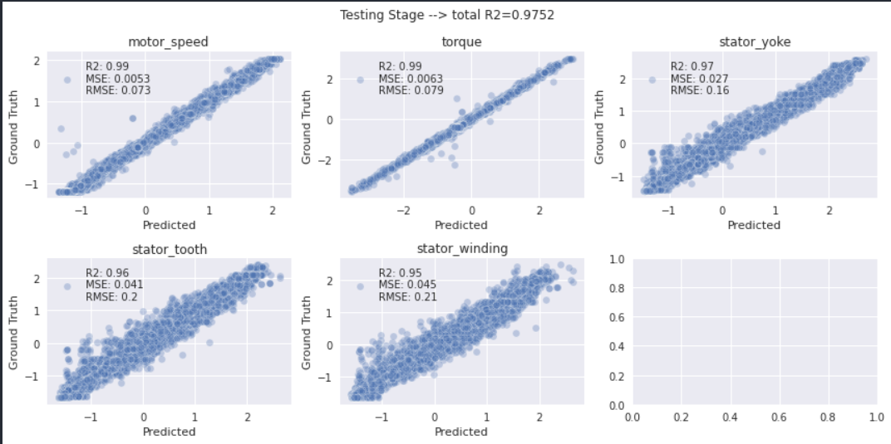

# Permanent Magnet Synchronous Motor (PMSM)

The heat loss and cooling modes of a permanent magnet synchronous motor (PMSM) directly affect its temperature rise. The accurate evaluation and prediction of stator winding temperature is of great significance to the safety and reliability of PMSMs. (

This dataset provides readings from several sensors fitted to monitor the main two pieces of PMSMs, namely the **stator** and the **rotor**. Below image showcases the components under consideration.


Generally, due to presence of moving parts working under various states of the motor speed and torque (a point at the motor speed x torque plain) thermal losses will be generated which impact the equipment in the long run shortening its lifespan. The copper loss of a permanent magnet motor stator directly affects the heating degree of the stator winding.


Below is a simple description of the data from the sensors mentioned above:

* " **u_q** ": q component of Voltage measured in Volts0
* " **u_d** ": d component of Voltage measured in Volts
* " **i_q** ": q component of Current measured in Amps
* " **i_d** ": d component of Current measured in Amps
* " **ambient** ": ambient temperature around the stator in °C (measured by a thermal sensor fixed close to stator)
* " **coolant** ": motor coolant (water in this case) temperature of the motor in °C (measured by a fixed thermal sensor at coolant outlet)
* " **motor speed** ": ambient temperature around the stator in °C (measured by a fixed thermal sensor)
* " **stator_tooth** ": stator tooth temperature in °C
* " **stator_winding** ": stator winding temperature in °C
* " **stator_yoke** ": stator yoke temperature in °C
* " **pm** ": permanent magnet tooth temperature in °C
* " **profile_id** ": id of the measurement session

Ps. all the data point are recorded in 2Hz (one row per 0.5 seconds)

## Training Stage

In this notebook I have built a **1D Convolutional Neural Networks (CNN) based Deep Learning architecture** which **predicts the following 5 target features**:
* Predicted Stator Readings
    * Stator tooth temperature (stator_tooth)
    * Stator winding temperature (stator_winding)
    * Stator yoke temperature (stator_yoke)
    
* Predicted Rotor Readings
    * Motor Speed (motor speed)
    * Torque (torque)
    
The model which accepts the following as the **input features**:
* Voltage q-component (u_q)
* Voltage d-component (u_d)
* Current d-component (i_q)
* Current q-component (i_d)
* Coolant temperature (coolant)
* Ambient temperature (ambient)

Below you can see a representation of the training



## Testing Stage

The testing was conducted on an unseen part of the dataset. You can see a **cross-plot of actual values vs the predicted values**.



## Developing

To clone this project and build your awesome next-gen solution based on it:

```shell
git clone https://github.com/DataMonarch/pmsm
```

## References
* Article: Predicting Temperature of Permanent Magnet Synchronous Motor Based on Deep Neural Network (https://www.researchgate.net/publication/344972500_Predicting_Temperature_of_Permanent_Magnet_Synchronous_Motor_Based_on_Deep_Neural_Network)